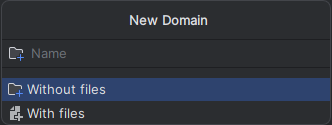

<h1 align="center">
  This plugin is <strong>NOT</strong> published anywhere!
</h1>
<p align="center">You have to build it yourself!</p>

# The structure generated by the plugin:
```
example
├── application
│   ├── dto
│   │   ├── ExampleRequest.kt
│   │   └── ExampleResponse.kt
│   ├── route
│   │   └── ExampleRoutes.kt
│   └── usecase
│       └── ExampleUseCase.kt
├── domain
│   ├── entity
│   │   └── ExampleEntity.kt
│   ├── repository
│   │   └── ExampleRepository.kt
│   └── usecase
│       └── ExampleUseCase.kt
└── infrastructure
    ├── persistence
    │   └── ExampleTable.kt
    └── repository
        └── ExampleRepository.kt
```

---
# Images:





---
# Generated Files:

- [ExampleRequest.kt](readme/example/application/dto/ExampleRequest.kt):
- [ExampleResponse.kt](readme/example/application/dto/ExampleResponse.kt)
- [ExampleRoutes.kt](readme/example/application/route/ExampleRoutes.kt)
- [ExampleUseCaseImpl.kt](readme/example/application/usecase/ExampleUseCaseImpl.kt)
- [ExampleEntity.kt](readme/example/domain/entity/ExampleEntity.kt)
- [ExampleRepository.kt](readme/example/domain/repository/ExampleRepository.kt)
- [ExampleUseCase.kt](readme/example/domain/usecase/ExampleUseCase.kt)
- [ExampleTable.kt](readme/example/infrastructure/persistence/ExampleTable.kt)
- [ExampleRepositoryImpl.kt](readme/example/infrastructure/repository/ExampleRepositoryImpl.kt)

---

I created this plugin for myself, but if you have similar needs - feel free to use/fork it ;)
